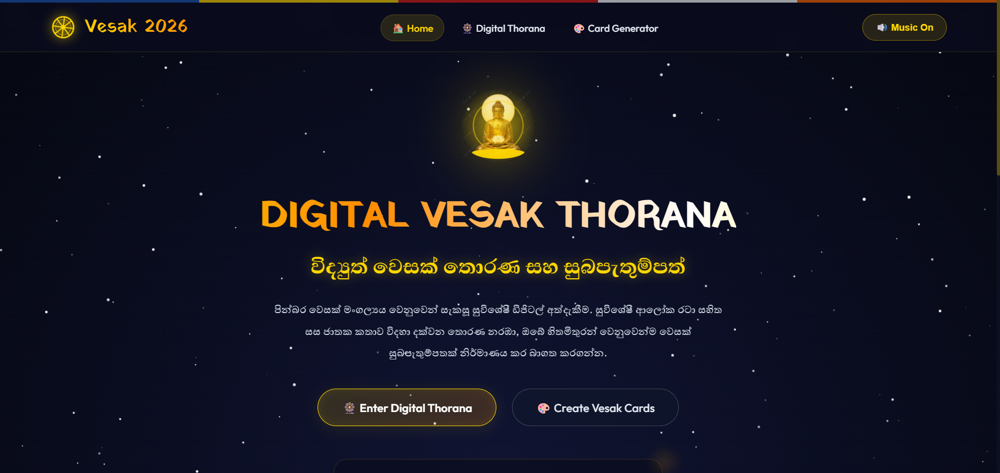
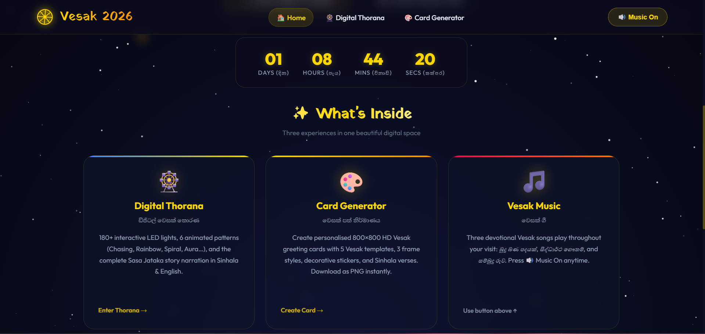
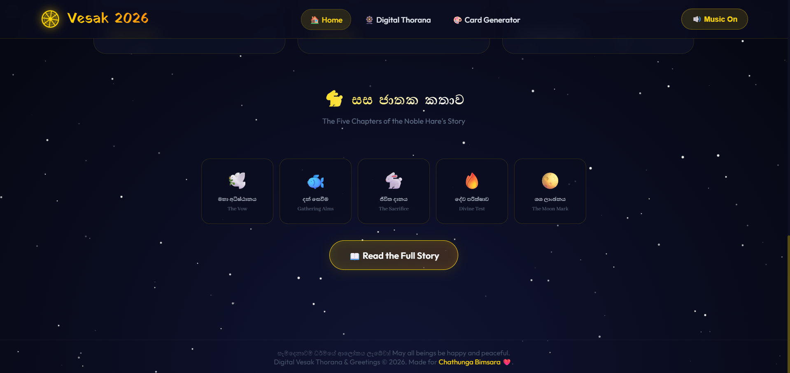
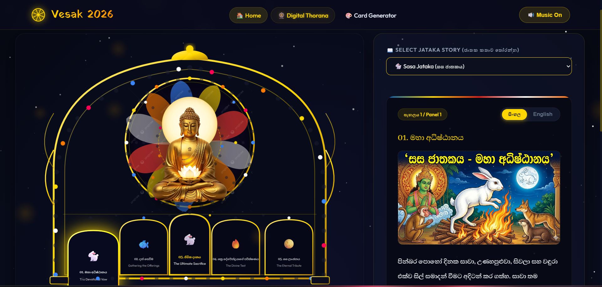
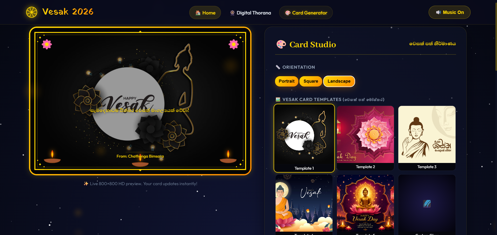

# 🌕 Digital Vesak Thorana 2026

> **ඩිජිටල් වෙසක් තොරණ සහ වෙසක් සුබපැතුම්පත්** — A stunning, interactive, and culturally rich digital experience dedicated to Vesak Poya 2026.

---

## ✨ Project Overview

A complete **full-stack frontend** digital Vesak celebration platform featuring:

- **Interactive Digital Thorana** (180+ animated LED lights + Sasa Jataka story)
- **Advanced Vesak Card Generator** (5 templates, frames, stickers, custom text, download/share)
- **Devotional Music Player** with 6 authentic Sinhala Vesak songs
- **Beautiful Sinhala & English** bilingual interface
- **Mobile-first responsive design** with immersive starry night & lantern animations

**Made with ❤️ for Chathunga Bimsara**

---

## 🎯 Features

### 1. Digital Thorana (🎡)
- Realistic SVG Vesak Pandal with 6 lighting patterns:
  - Chasing Lights
  - Golden Aura
  - Sparkle Effect
  - Rainbow Flag
  - Spiral Swirl
  - Breathing Calm
- Clickable Jataka story panels (Sasa Jataka + more)
- Standing Buddha animation
- Auto-play story narration with speech synthesis
- Real-time light controls

### 2. Vesak Card Generator (🎨)
- **Live 800×800 HD Preview**
- 5 Premium Vesak Templates
- 3 Frame styles (Gold, Floral, Neon)
- Decorative stickers (Oil lamps, Lotuses, Lanterns)
- Custom greeting text with Sinhala font support
- Gold gradient text, alignment, size & positioning controls
- One-click **Download PNG** + **Share** (Web Share API)

### 3. Immersive Experience
- Background floating lanterns
- Twinkling stars
- Smooth SPA navigation
- Welcome overlay with Dharma wheel
- Persistent devotional music across pages

---

## 🛠️ Tech Stack

- **HTML5 / CSS3** (Modern, Glassmorphism, Gradients)
- **Vanilla JavaScript** (No frameworks — lightweight & fast)
- **Canvas API** (Card rendering)
- **SVG** (Thorana structure & animations)
- **Google Fonts** (Abhaya Libre, Outfit, Yatra One)
- Fully Responsive (Mobile + Desktop)

---

## 📁 Project Structure

Vesak-2026/
├── index.html
├── thorana.html
├── card-genarate.html
├── style.css
├── script.js
├── assets/
│   ├── buddha.png
│   ├── vesak1.png, vesak2.png, vesak3.png, vesak4.png, vesak5.png
│   └── audio/ (6 Vesak songs)
├── README.md
└── (future: manifest.json, service-worker.js for PWA)

---

## 🚀 How to Run

1. Download the full project
2. Open `index.html` in any modern browser (Chrome/Firefox recommended)
3. Click **Enter Website** → Enjoy the full experience!

> **Note**: Audio may require user interaction due to browser autoplay policies.

---

## 🎨 Screenshots

---

## 🌟 Highlights

- **Cultural Authenticity**: Proper Sinhala typography and traditional Vesak elements
- **Performance Optimized**: Smooth 60fps animations
- **Accessibility**: Bilingual support + keyboard friendly
- **Shareable**: Cards can be easily shared on social media
- **Made with Love**: Dedicated to Chathunga Bimsara

---

## 🙏 Credits

- **Creator**: Chathunga Bimsara
- **Design & Development**: Custom built for Vesak 2026
- **Music**: Artists featured — Mangala Denex, Viraj Perera, Vidusha Rajaguru, etc.
- **Inspiration**: Traditional Sri Lankan Vesak Thorana & Buddhist values

---

## 📜 License

This project is for **personal & cultural use**. Feel free to share and spread the blessings.

**සැමට පින්බර වෙසක් මංගල්‍යයක් වේවා!**  
**May all beings be happy, peaceful, and enlightened.**

---

**Digital Vesak Thorana & Greetings © 2026**  
Made with devotion for **Chathunga Bimsara** ❤️